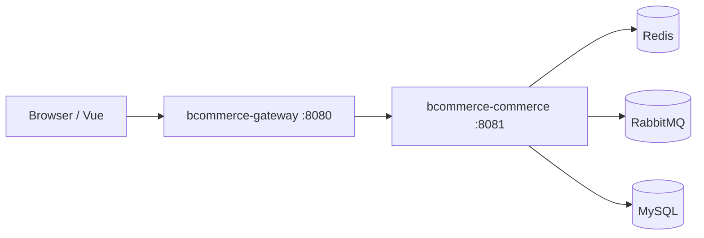

# 系统架构与模块划分

## 1. 目标与边界

本仓库演示 **垂直电商 + 秒杀 + 风控异步审核** 的一条可运行链路，面向简历说明 **高并发场景下的常见工程手段**：缓存、分布式锁、MQ 削峰填谷、分表路由、网关限流与熔断。

**关于 10k+ QPS**：单机 Demo 不宣称实测万级；文档描述的是 **水平扩展后可承载的方向**（多实例网关/业务、Redis 集群、MQ 集群、DB 读写分离与分片中间件）。面试中应区分设计能力与线上峰值数据。

## 2. 逻辑架构（微服务切分）

- **网关**：Spring Cloud Gateway，统一入口；Redis 令牌桶限流；Resilience4j 熔断回退。
- **业务服务**：商品、交易、营销（秒杀）、履约、结算、风控（异步）共 **6 个领域包**，满足不少于 5 个核心业务模块的要求。

## 3. 核心业务模块（包级）

| 模块 | 包路径 | 职责 |
|------|--------|------|
| 商品 | `product` | SPU/SKU、上架；列表 Redis 缓存与失效 |
| 交易 | `trade` | 秒杀下单、订单明细、支付 mock、幂等 |
| 营销 | `marketing` | 活动库存 Redis 镜像 + Lua 原子扣减 |
| 履约 | `fulfillment` | 监听 `order.created`，回写运单态 |
| 结算 | `settlement`（数据表 + 写入） | 订单级商家入账与平台费字段 |
| 风控 | `risk` | 监听 `order.risk`，异步落审核任务 |

## 4. 高并发与一致性（设计要点）

1. **读多写少**：商品货架列表走 Redis 缓存（短 TTL），写后删键；**关键词检索**走 Elasticsearch（未就绪时回退 MySQL `LIKE`），启动时全量索引、商家发品增量写索引。
2. **秒杀写路径**：用户维度限流 + **Redis 分布式锁**（防同用户并发提交）+ Lua 预减活动库存；DB 条件更新 `sold_stock` 与 SKU 库存同事务。
3. **削峰**：下单成功后发 MQ；履约与风控 **异步消费**，缩短同步链路 RT。
4. **分表**：`bc_trade_order_{0,1}` / `bc_trade_order_item_{0,1}` 按 `user_id % 2` 路由（`OrderSharding` + MyBatis `${shard}`）。生产可替换为 ShardingSphere / 中间件，不改业务语义。
5. **网关层**：IP 维度 RequestRateLimiter；下游失败进入熔断 fallback。

## 5. 数据库表（不少于 8 张）

类目、SPU、SKU、用户、秒杀活动、订单（2 张分表）、订单明细（2 张分表）、履约任务、结算流水、幂等、风控规则、风控任务（共 **12 张物理表**，逻辑上订单域为分表模型）。

## 6. 调试与压测

见仓库 `scripts/`：`debug-api.ps1`（冒烟）、`stress_seckill.py`（并发下单，默认走网关 8080）。
