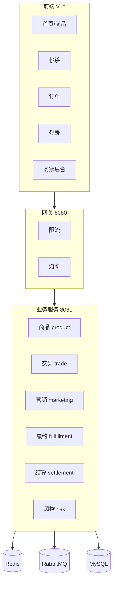

# 分布式电商演示平台 - 项目报告模板与讲解提纲

> 本文档按常见项目汇报结构组织：背景、功能、技术方案、实现流程、结果展示说明与复盘要点。可直接作为报告草稿，也可以按个人风格裁剪。

---

## 一、项目背景（约 450 字）

随着电商与秒杀类活动普及，系统在瞬时流量、库存一致性与跨模块协作上面临典型分布式问题：单点数据库难以横向扩展、同步链路过长导致超时、热点数据击穿等。课堂上的理论（CAP、消息模型、分片等）需要在可运行工程中落地，才能形成可复述、可演示的工程经验。

本项目的价值在于：**以最小可运行闭环展示如何在可理解前提下，用成熟组件缓解峰值压力**。它并非生产系统，但能帮助团队快速理解：网关如何保护下游、缓存与锁如何配合避免超卖、消息队列如何将非强感知链路异步化，从而提升吞吐与可用性。对分布式工程实践的意义在于，将"通信 / 状态 / 一致性边界"串成一条完整链路：**通信**（HTTP、MQ）、**状态**（MySQL 分表、Redis）、**边界**（同步链路聚焦核心写路径，履约与风控走异步）。

---

## 二、功能描述（约 750 字）

### 2.1 总体目标

构建 **B/C 端垂直电商 + 秒杀 + 异步履约与风控** 的演示链路：买家浏览商品与活动、参与秒杀下单、查看订单与风控状态；商家发布商品（SPU/SKU）、查看与本店相关的订单。所有 C/B API 经 **API 网关** 统一入口，便于限流与熔断演示。

### 2.2 功能模块图



### 2.3 按模块说明

| 模块 | 主要功能 |
|------|----------|
| 商品 | 类目、SPU/SKU；货架列表可走缓存；商家上架 |
| 营销/秒杀 | 活动配置、Redis+Lua 预减库存、用户维度限流、下单分布式锁与幂等 |
| 交易 | 分表订单与明细、模拟支付、订单查询 |
| 履约 | 消费 `order.created`，异步更新出库与物流单号 |
| 结算 | 订单级入账与平台费流水 |
| 风控 | 消费 `order.risk`，异步写入审核任务；订单维度查询风险状态 |

### 2.4 数据库表结构（不少于 8 张，本项目实际更多）

以下为 `schema.sql` 中的物理表（订单域按用户分两片，计为多张物理表）：

1. `bc_category` : 类目  
2. `bc_product_spu` : 商品 SPU  
3. `bc_product_sku` : SKU 与库存售价  
4. `bc_user_account` : 用户与角色  
5. `bc_seckill_activity` : 秒杀活动  
6. `bc_trade_order_0` / `bc_trade_order_1` : 订单分表  
7. `bc_trade_order_item_0` / `bc_trade_order_item_1` : 订单明细分表  
8. `bc_fulfillment_task` : 履约任务  
9. `bc_settlement_entry` : 结算流水  
10. `bc_idempotency` : 幂等令牌  
11. `bc_risk_rule` / `bc_risk_audit_task` : 风控规则与审核任务  

### 2.5 主页面（不少于 5 个）

前端路由对应页面：`/` 首页（商品）、`/seckill` 秒杀、`/orders` 订单（需登录）、`/login` 登录、`/merchant` 商家后台（商家角色）。共 **5** 个独立视图，覆盖买家和商家的主流程页面。

---

## 三、技术方案

### 3.1 整体方案（约 280 字）

**选型**：后端采用 **Spring Boot** 承载领域服务，**Spring Cloud Gateway** 作为独立网关进程；数据层 **MySQL** 持久化，**Redis** 做热点缓存、秒杀库存镜像、分布式锁与用户限流计数，**RabbitMQ** 做异步消息削峰。持久层 **MyBatis**（含动态表名分片）。前端 **Vue 3** 单页应用。  

**考虑**：本仓库优先“可一键拉起、可快速验证”，故未强制引入 Nacos 等服务发现，网关路由静态指向业务端口；分表采用 **应用层路由 + MyBatis**，避免在网络受限环境中增加额外依赖。后续可平滑演进为注册中心 + ShardingSphere 等方案。

### 3.2 典型技术点及其作用（约 720 字）

**（1）Redis：缓存、原子扣减与锁**  
商品列表等读多场景使用缓存减轻 DB QPS；秒杀活动库存使用 **Lua 脚本** 在单 key 维度原子判断与扣减，减少"先读后写"竞态。同一用户下单使用 **分布式锁**（带过期时间），避免客户端重试或双击导致并发双单。限流计数使用 Redis 滑动/固定窗口（按业务实现），与网关限流形成"边缘 + 业务"两道闸。

**（2）消息队列：异步与削峰**  
下单主事务成功后发布消息：`order.created` 驱动履约任务写入与后续状态更新；`order.risk` 驱动风控审核任务落库。作用有三：缩短用户感知的同步 RT；用消费速率平滑写入峰值；将风控、出库等非强一致同步环节与核心下单解耦（最终一致语义在系统说明中单独标注同步边界）。

**（3）MySQL 分表**  
订单与明细按 `user_id % 2` 路由到 `_0` / `_1` 表，演示 **水平分片** 的基本思路：分片键选择用户 ID 使同一用户订单局部聚集，便于列表查询；商家跨分片查询可采用 UNION 或中间件聚合。与 CAP 联系起来：分片后跨片强一致事务成本上升，故本 Demo 以单用户订单一致性为主。

**（4）网关限流与熔断**  
Gateway 使用 **Redis RequestRateLimiter** 等对入口限流；对下游 commerce 配置 **Resilience4j CircuitBreaker**，失败率升高时快速失败并返回 fallback，避免线程与连接打满，体现 **背压与降级** 思想。

以上组合可概括为：**同步路径做“必须且短”的事，异步路径做“可恢复、可重试”的事，Redis 扛热点，DB 做权威账本**。

---

## 四、实现流程（约 1100 字）

### 步骤 1：环境与基础数据

使用 `docker-compose`（或仓库脚本）启动 MySQL、Redis、RabbitMQ。执行 `bcommerce-commerce/src/main/resources/schema.sql` 初始化表与种子数据（类目、风控规则等）。分别启动 **网关**（默认 8080）与 **业务服务**（默认 8081），前端开发服务器代理或直连网关基地址，保证浏览器请求走统一入口。

### 步骤 2：领域模型与持久层

划分 `product`、`trade`、`marketing`、`fulfillment`、`settlement`、`risk` 包，各自 Controller/Service/Mapper 边界清晰。订单 Mapper 根据 `OrderSharding.slot(userId)` 选择 `bc_trade_order_0` 或 `bc_trade_order_1` 及对应明细表，XML 中使用受控占位（仅 0/1）防止 SQL 注入。用户、活动、SKU 等走单表或常规查询。

### 步骤 3：秒杀核心链路

活动创建后，将活动库存镜像写入 Redis；C 端秒杀接口先过网关限流，再经业务侧用户限流，获取分布式锁后执行 Lua 扣减，随后在 **同一数据库事务** 内条件更新 `bc_seckill_activity.sold_stock` 与 `bc_product_sku.stock`，失败则回滚并视策略回补 Redis。写入订单分表后，发送 MQ 消息，释放锁与幂等记录。

### 步骤 4：异步消费者

编写 Rabbit 监听：`FulfillmentMessageListener` 消费创建订单事件，插入/更新 `bc_fulfillment_task`；`RiskReviewListener` 消费风控队列，写入 `bc_risk_audit_task`。注意 **幂等与重复消费**：生产可用业务唯一键或消费端去重表扩展。

### 步骤 5：前端与联调

Vue 路由配置五个主页面；登录后 JWT 存前端，请求头携带 `Authorization`。商家页校验角色。联调用 `scripts/debug-api.ps1` 或 `scripts/debug-api.sh` 做冒烟，再用 `stress_seckill.py` 观察限流与库存行为。

### 核心代码示例（不计入上述字数，篇幅控制）

分片路由（示意，以仓库实际类名为准）：

```java
// OrderSharding.java 思路：shard = Math.floorMod(userId, 2)
public static int slot(long userId) {
    return Math.floorMod(userId, 2);
}
```

MyBatis 动态表名需在 XML 中严格限定 shard 取值集合（0/1），避免字符串拼接引入注入风险。

---

## 五、结果展示（截图与说明）

建议准备不少于三张关键截图。本地运行后可按下列说明组织截图文字。

**截图 1：首页商品列表**  
展示 Vue 首页加载的 SPU/SKU 或商品卡片，证明 **C 端浏览与缓存/查询链路** 可用；可标注浏览器地址栏为网关或前端 dev 端口。

**截图 2：秒杀页与活动信息**  
展示秒杀活动列表或某一活动的抢购界面，说明 **营销模块与 Redis 侧库存展示/扣减** 已接入；若配合开发者工具 Network，可标出请求经网关。

**截图 3：订单列表或订单详情（含风控/状态）**  
登录买家后打开"我的订单"，展示订单状态；若接口返回含风控字段，可在说明中写"风控结果由异步消费写入，页面展示最终一致语义"。

**可选截图 4：商家后台**  
商家账号登录 `/merchant`，展示 SPU/SKU 管理或订单列表，体现 **B 端与权限模型**。

**可选截图 5：网关熔断/限流或日志**  
触发高频请求后展示 429/503 fallback 或日志中的 traceId，说明 **治理手段可观测**。

---

## 六、心得体会（撰写参考，请结合自身经历修改）

### 6.1 技术体系评估（约 320 字）

目前已掌握：Spring Boot 基础开发、REST 设计、MyBatis 与简单 SQL 优化、Redis 基本数据结构、RabbitMQ 发布订阅概念、Docker 启动中间件、Vue 路由与状态管理入门。能独立完成单服务 CRUD 与前后端联调。不足之处：生产级 **分库分表中间件**（如 ShardingSphere）实操仍浅；**分布式链路追踪**（OpenTelemetry）与统一指标大盘未在本 Demo 全面落地；**分布式事务**（Seata 等）仅停留在理论对比，未在项目中强行接入以免过度复杂。后续将补充压测方法论（指标口径、瓶颈定位）与云原生存储选型。

### 6.2 技术收获（约 320 字）

通过对分布式技术的实践，理解了 **CAP 在工程中的折中**：例如用异步 MQ 换取更短主链路延迟，接受风控状态最终一致；理解了 **消息传递模型**（点对点与发布订阅）在履约与风控解耦中的作用；理解了 **分片策略**（哈希取模）对查询与扩容的影响。结合本项目，把网关、缓存、锁、MQ、分表从概念落实为可运行代码，能直接用模块图解释数据流与降级路径。

### 6.3 学习过程感悟（约 280 字）

非技术方面的收获包括：需求边界管理（Demo 与生产的区别）、文档化表达（让他人可复现环境）、时间分配（先打通主链路再补治理）。遇到依赖下载或编码问题时，学会了查日志、隔离问题（先验证 DB 再验证 MQ），而不是随机改配置。整理汇报材料的过程也训练了“结论先行、再举例”的表达方式，对后续实习与团队沟通都有帮助。

---

## 附录 A：常见问题与简明答法

### 1. 分布式系统的核心特征

**答**：多节点协作、无共享内存、网络通信带来延迟与分区；需关心一致性、可用性、分区容错及故障模型（节点宕机、网络抖动）。

### 2. HDFS 的原理与核心架构

**答**：主从架构：**NameNode** 管元数据（目录、块位置），**DataNode** 存实际块；文件切分为块多副本存储；读经 NN 定位块，写经流水线复制；NN 是单点瓶颈，生产用 HA（JournalNode + ZKFC）等方案。

### 3. 分布式的通信模型有哪些

**答**：直接远程调用（RPC/HTTP）、消息传递（MQ）、发布订阅、流式数据通道；还可区分同步/异步、一对一/一对多。

### 4. 消息传递的两种典型模型及核心作用

**答**：**点对点（队列）**：一条消息通常被一个消费者处理，用于任务分发与削峰。**发布订阅（Topic）**：多订阅者同时收到，用于事件广播。核心作用：解耦、异步、缓冲峰值、最终一致下的系统伸缩。

### 5. 分布式常用的通信协议有哪些

**答**：HTTP/HTTPS、gRPC（HTTP/2）、AMQP、MQTT、Kafka 协议、Redis 协议等；选型看语义、顺序性、吞吐与运维成本。

### 6. TCP 三次握手与四次挥手

**答**：**三次握手**：SYN -> SYN-ACK -> ACK，同步序列号并确认双向可达。**四次挥手**：FIN 与 ACK 分开发送，被动关闭方可能还有数据要发，故 ACK 与 FIN 不一定合并；TIME_WAIT 等待 2MSL 处理迟到的报文。

### 7. HTTP 与 HTTPS 的区别

**答**：HTTPS = HTTP + TLS；加密与完整性校验，身份认证（证书）；默认 443；有握手与证书校验开销。

### 8. 分布式通信常见异常有哪些

**答**：超时、部分失败、重复投递、乱序、网络分区、脑裂、雪崩（重试放大）等；工程上靠超时、幂等、限流、熔断、重试退避应对。

### 9. CAP 定理

**答**：一致性 C、可用性 A、分区容错 P 三者不能同时最优；分区发生时常在 C 与 A 间权衡。实际还有延迟与 **BASE**（基本可用、软状态、最终一致）等工程补充。

### 10. 分布式常用的分片策略有哪些

**答**：哈希取模、一致性哈希、范围分片、目录表/映射表、地理分片等；本项目订单为 **用户 ID 哈希取模** 到两片表。

### 11. ZooKeeper 的工作原理

**答**：ZAB 协议保证顺序与一致性；Leader/Follower；提供临时顺序节点、watch、分布式锁与选主等协调能力；注意会话与脑裂防护。

### 12. 分布式事务的容错机制

**答**：2PC/3PC、TCC、Saga、可靠消息最终一致、Outbox 等；容错包括超时决策、补偿、幂等、对账与人工介入。

### 13. 云部署的三种方式

**答**：公有云、私有云、混合云（数据与合规在私有，弹性在公有等组合）。

### 14. IaaS / PaaS / SaaS 区别

**答**：**IaaS** 提供虚拟机/网络/存储；**PaaS** 再提供运行时与中间件托管；**SaaS** 直接提供应用软件。抽象层级递增，用户可控性递减。

### 15. Docker 常用命令有哪些

**答**：`docker ps` / `docker ps -a`，`docker images`，`docker run -d -p`，`docker logs -f`，`docker exec -it`，`docker compose up -d`，`docker compose down`，`docker pull`，`docker rm` / `docker rmi` 等。

---

## 附录 B：文档与仓库索引

| 内容 | 路径 |
|------|------|
| 架构说明 | `docs/ARCHITECTURE.md` |
| 项目文件索引 | `docs/PROJECT-FILES.md` |
| DDL | `bcommerce-commerce/src/main/resources/schema.sql` |
| 调试脚本 | `scripts/debug-api.ps1`、`scripts/debug-api.sh` |

讲解建议：**先给一句结论 -> 再举本项目中的例子 -> 最后说明 Demo 边界与可演进方向**。
